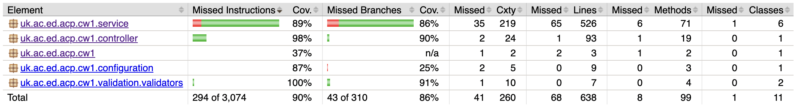

# Test Evidence and Evaluation
## Testing Techniques Applied
### Boundary Value Analysis (BVA)
Applied to **U-01 (isCloseTo)**

| Test Case | Input Distance | Expected | Rationale |
|-----------|----------------|----------|-----------|
| `testIsCloseTo_exactlyAtThreshold` | 0.00015 | `false` | On boundary (strictly less than) |
| `testIsCloseTo_justBelowThreshold` | 0.000149 | `true` | Just inside boundary |
| `testIsCloseTo_justWithinBoundary` | 0.00015 - 0.000000001 | `true` | Epsilon below boundary |
| `testIsCloseTo_farPositions` | Large distance | `false` | Nominal false case |

This technique was chosen because `isCloseTo` has a precise threshold where off-by-one errors would cause path calculation failures.

### Equivalence Partitioning (EP)
Applied to **U-02 (isInRegion)**

| Partition | Test Case | Rationale |
|-----------|-----------|-----------|
| Inside polygon | `testIsInRegion_pointInRegion` | Valid delivery location |
| Outside polygon | `testIsInRegion_pointFarOutside` | Safe flight path |
| On edge | `testIsInRegion_pointOnEdge` | Boundary case |
| On vertex | `testIsInRegion_pointOnVertex` | Corner case |
| Concave region | `testIsInRegion_concaveRegion` | Complex no-fly zone shape |
| In concave notch | `testIsInRegion_concaveRegion` (inNotch) | Point outside due to concavity |

This technique ensures the ray casting algorithm handles edge cases.

### Mocking and Isolation
Applied to **I-01, I-02, I-03** to test `DroneService` independently of the external API.

```java
@Mock
private ExternalAPIService externalAPIService;

when(externalAPIService.getAllDrones()).thenReturn(List.of(
    new Drone("D001", "TestDrone", new Capability(10.0, true, false, 2000, ...))
));
```

**Why mocking was necessary:**
- External ILP REST API is outside our control
- Tests must be deterministic and repeatable
- Enables testing of failure scenarios (I-03) without network issues or dependency on external services


### Negative Testing
Applied to **V-01, V-02** to verify error handling.

| Test Case | Invalid Input | Expected Response |
|-----------|---------------|-------------------|
| `testDistanceTo_missingPosition1` | Missing required field | HTTP 400 |
| `testIsInRegion_openPolygon_returnsBadRequest` | First ≠ last vertex | HTTP 400 |
| `testQueryAvailableDrones_invalidDate` | Malformed date string | HTTP 400 |


## Code Coverage

### JaCoCo Report



**Coverage Results:**

| Package | Instruction Cov. | Branch Cov. | Lines | Methods |
|---------|------------------|-------------|-------|---------|
| `service` | 89% | 86% | 526 (65 missed) | 71 (6 missed) |
| `controller` | 98% | 90% | 93 (1 missed) | 19 (1 missed) |
| `validation.validators` | 100% | 91% | 7 (0 missed) | 4 (0 missed) |
| `configuration` | 87% | 25% | 9 (0 missed) | 3 (0 missed) |
| **Total** | **90%** | **86%** | 638 (68 missed) | 99 (8 missed) |

## Coverage Analysis

**Well covered areas:**
- `controller` (98% instruction, 90% branch) — thorough endpoint testing via MockMvc
- `validation.validators` (100% instruction, 91% branch)
- `service` (89% instruction, 86% branch) — strong coverage of core system logic

**Lower coverage areas:**
- `configuration` branch coverage (25%) — Spring configuration classes have conditional beans that aren't all exercised in tests
- `service` missed branches (14%) — some edge cases in `PathfindingService` helper methods tested indirectly

### Coverage Adequacy

The **90% overall instruction coverage** and **86% branch coverage** exceed typical industry targets (70-80%). Key observations:

- **Validators at 100%** — critical for input validation requirements (V-01, V-02)
- **Controllers at 98%** — ensures HTTP layer behaves correctly
- **Services at 89%** — core logic well-tested; remaining gaps are in complex pathfinding edge cases


## Testing Limitations
### What testing does not cover
| Limitation | Impact | Mitigation |
|------------|--------|------------|
| **Path optimality** | `calcDeliveryPath` may return valid but suboptimal routes | Accepted — specification requires valid paths, not optimal ones |
| **Real API behaviour** | Mocked responses may differ from live ILP REST API | Manual smoke testing against live endpoint before submission |
| **Concurrency** | No load testing for race conditions under parallel requests | Low risk — single-user marking environment expected |
| **Floating-point edge cases** | Geometric calculations may have precision issues at extreme coordinates | Mitigated by using delta comparisons in assertions |


### Gaps in test coverage
| Gap | Reason | Severity |
|-----|--------|----------|
| No mutation testing | Time constraints; would verify test effectiveness | Low |
| Limited GeoJSON validation | Only checks structure, not coordinate correctness | Medium |
| No container integration test | Docker tests are manual | Low — S-02 covered by health endpoint test |


### Statistical Evaluation

**Test yield analysis:**
- Unit tests: High yield — pure functions with predictable inputs/outputs
- Integration tests: Medium yield — dependent on mock accuracy
- System tests: Lower yield per test — complex interactions harder to isolate

**Defect detection probability:**
- BVA tests for `isCloseTo`: High — boundary errors are common in threshold comparisons
- EP tests for `isInRegion`: High — geometric algorithms often fail on edge/vertex cases
- Mock-based integration tests: Medium — may miss issues arising from real API response formats

